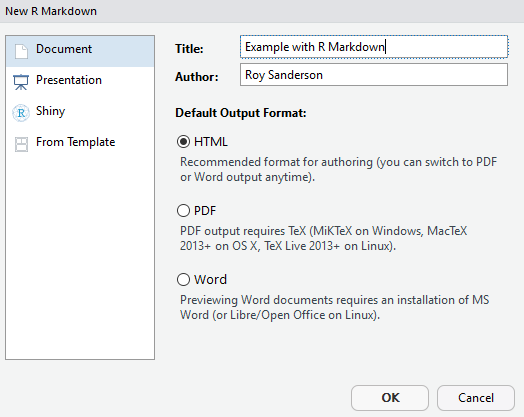

```{r setup, include=FALSE}
knitr::opts_chunk$set(echo = TRUE)
```

# 6. Reproducible research
Ideally you want to be able to create reproducible your research, so that it can be undertaken by someone else, following your instructions, in the same way as you would a laboratory report. If you are writing your own documents, you want to ensure that the text in it accords exactly with the data. This is why it is best to clean up the raw data in R, rather than editing it in Excel. RStudio projects greatly facilitate good practice, for example in an RStudio project folder I often have separate sub-folders for

* data (raw data)
* figs (usually ggplot figs or maps generated by R)
* R ( if it is a very complex set of analyses, I might put R functions into their own sub-folder, and use the `source` function at the start of a `main.R` script in the project folder itself)

Depending on the complexity of the project, you might want output folders for Word documents or processed data.

At this point you might be wondering how to create Word documents. The `Rmarkdown` and `knitr` packages provide a powerful method of writing text in R, and creating high-quality documents.  Begin by installing the rmarkdown package:

```{r install rmarkdown, eval=FALSE}
# Install rmarkdown from CRAN
install.packages("rmarkdown")
```

Now, instead of a standard R script, you are going to create an RMarkdown script. Click on `File -> New File` and select the `R Markdown` option. A setup screen will appear for you to enter details about your document:



A new `Untitled1` file will be created, that is already pre-populated with some text. Save the file in your project, giving it a name ending in `.Rmd` to indicate that it is markdown format.  Click on the `knit` button at the top of the RMarkdown file and it will be instantly converted into HTML format for viewing. If you want a Word document, that is also available via the down-arrow next to the Knit button. You may have to open Word first, but usually it should display automatically. When preparing documents I tend to work mainly in HTML for previewing the output, as it is slightly quicker to Knit together.

The example script already shows you a lot of features of RMarkdown. You can embed R code, decide whether or not to display the R code, or just the output, decide whether to execute the code, etc. You also have control on text size, can create equations, and so on.  For example `_italics if prefix or suffix with an underscore or one asterisk_` will display _italics if prefix or suffix with an underscore or one asterisk_ whilst `**bold if prefix or suffix with two asterisks**` will give **bold if prefix or suffix with asterisks**. Lines that begin with a `#` symbol control the headings, sub-headings etc., with the more `#` symbols the lower the subheading.  Therefore

`## This is a level 2 heading`
gives

## This is a level 2 heading

whilst
`### This is a level 3 heading`
gives

### This is a level 3 heading

Look at the code "chunks" in the example markdown document. Notice how sets of R commands begin and end with three backslash symbols. The buttons on the right allow you to execute the code in all preceding chunks, or just the one you are working on.

*Exercise* : Copy and paste R code from your oystercatcher analysis script into your new RMarkdown document. Try and write a simple narrative about what you are doing. You will then have a complete document that is reproducible, and shows the results of your analyses.

There is a lot of useful online information on RMarkdown, including a 'cheat sheet' (available from RStudio Help menu), the main website <https://rmarkdown.rstudio.com> and an online book <https://bookdown.org/yihui/rmarkdown/>. The latter was only published in 2019, so this is a fast-moving field. You can even include references and bibliographies in the system (I will admit that I haven't progressed that far yet.)

Finally, this practical schedule was not written in Microsoft Word, it was written in RMarkdown!  As it is hosted on Github, you can download this document and edit and play with it yourself. This will also improve your skills. If you want to clone the RMarkdown file, and all the associated documents, open up a Git command window from the Command Line and type

`git clone https://github.com/rasanderson/BIO8068_reproducible.git`

As this is a public repository, and you are pulling rather than pushing changes, it should not prompt you for a username or password.