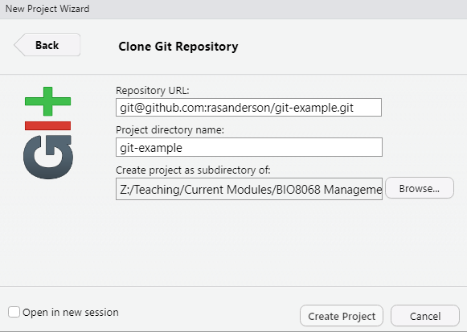
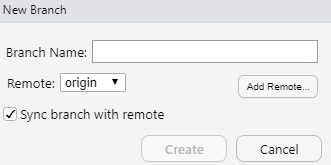

# 1. Introduction
When you are undertaking large complex analyses, it is easy to end up with multiple R scripts, and therefore become confused as to which version is the correct one for your report. Before _version control_ systems were introduced this was a common problem, and I will admit to having some (published) research where relevant scripts include `main_analysis.R`, `main_analysis_final.R`, `main_analysis_final_v2.R` etc. You may have encountered similar problems using Microsoft Word for reports. Another challenge is that of word-processing the Microsoft Word document, then copying and pasting the relevant graphs or tables from RStudio into Word. If your data changes even slightly, all the numbers, tables and graphs will need to be re-copied, and it is easy to make an error.  The aim of this practical is to:

* introduce you to version control using git
* show you how to use remote repositories on GitHub
* explain how to write documents in RStudio RMarkdown that automatically generate Word reports, with R graphs and tables already embedded in them.

# 2. Version control with git
The most popular version control system is git, which is installed on the Campus machines. It is freely-available, and there is excellent tutorial information at <https://git-scm.com/> . Even better, Jenny Bryan has written an excellent online book **Happy Git with R** aimed at RStudio users with no prior knowledge of git, which can be found at <https://happygitwithr.com/index.html>. Git was originally a Linux-based (Mac and Unix) system for version control, but has been ported to Windows; it can be run through a command prompt (either from Windows, or within RStudio) but this can be tricky to get used to if you are unfamiliar with Linux. However, only a small number of commands are needed to get started, and we will focus on using git through the GUI.  Remember that your common working pattern is to create files/scripts, save them, edit them, save them *again*. Git allows you to keep track of this process. Specifically, that last step:

* When you saved it again
* Why you saved it again
* What the contents of the change were

This allows you to track the history of changes you've made to a file:


Most importantly, if you need to, you can easily go back to an earlier version of your file. It is too easy in my experience to have some ecological analysis working perfectly in R, go back to it a few days later, a couple of minor edits, and suddenly it doesn't work but you don't know why. With and without version control:

```{r echo=FALSE, warning=FALSE, out.width="250px"}
knitr::include_graphics("figs/with_and_without_git.png")
```


If you are working in a team with other scientists this becomes particularly powerful, as you can 'merge' changes made by different staff:


## 2.1 Checking if git is already installed
Git is a separate program to RStudio and so needs to be setup independently. First of all you have to check whether git has already been installed onto your machine; it varies and it may have already installed it indirectly from another programme. To check, the easiest method is to use the command 'shell'. This is a window into which you can type commands that the computer's underlying operating system understand. The easiest way of doing this is from inside RStudio. Simply click on the menu `Tools -> Terminal -> New Terminal` and you should notice that instead of the RStudio Console window, you now have an RStudio Terminal window. The only obvious difference is that the Console window begins:

`>`

as it expects you to enter R commands, whereas the Terminal window begins:

`$`

as it expects you to enter Windows, Mac or Linux commands. To check whether git is already installed, at the `$` prompt type:

`which git`

to simply ask the computer to tell you which (if any) version of git it is using. On a Windows machine it will probably return something like:

`/mingw64/bin/git`

whilst on a Mac you may see

`/usr/local/bin/git`

If you get either of the above, then you can also check which version of git you are using:

`git --version`

and this is returning `git version 2.20.1.windows.1` for me. However, if you receive:

`which: no git in (/ming64/bin:/usr/bin:/c/Users/nras/bin:/c/R-4.0.2/bin/x64:/c/Program Files (x86)/Common Files/Oracle/Java/javapath:/c/WINDOWS/system32:/c/WINDOWS)`

or

`which: git not found`

then you need to install it. Fortunately, it is free, and easy to install.

## 2.2 Installing git on your PC or Mac
There are several git packages available, but you'll probably find the "official" ones easiest, at <https://git-scm.com/download/> where you should see something similar to:


If during the **Windows** installation note that:

* When asked about “Adjusting your PATH environment”, make sure to select “Git from the command line and also from 3rd-party software”. Otherwise, accept the defaults.
* RStudio for Windows sometimes prefers for Git to be installed below `C:/Program Files` and this appears to be the default. This implies, for example, that the Git executable is found at `C:/Program Files/Git/bin/git.exe`. Unless you have specific reasons to otherwise, follow this convention. However, on my NUIT-managed PC, a slightly different installation has been used and git is in the `C:/Users` roaming profile area, as multiple users have accounts. Nevertheless, RStudio still locates it successfully.

For **Mac OS** machines git installation is usually straightforward, but let me know if you have any problems.

# 3. Git configuration
Before you can use git it is best to configure it properly. At a minimum, it is useful to tell it your name and email address. At the `$` prompt, i.e. in the **Terminal** window in RStudio, **not** the R Console windows, type, using your email and username, the following. I recommend using `@newcastle.ac.uk` rather than `@ncl.ac.uk` in your email:

`git config --global user.name 'John Smith'`

`git config --global user.email 'j.smith123@newcastle.ac.uk'`

`git config --global --list`

The last command simply checks that git has stored the configuration correctly, and should return the information you have just entered. Having your email and username configured is particularly useful should you do any collaborative work so that it is easy to track who has made which changes.

# 4. What is a "Repository"?
As soon as you start reading about git, you will come across the word _repository_, often shortened to *repo*. A repository is simply a folder that is under git version control. It contains some special files and folders to track all the different edits and changes you are making to your R scripts. Importantly, a **local repository** stored on your own PC can also be "pushed" or "pulled" to and from an internet server, where it is called a **remote repository**. This allows easy collaboration. Even if doing a project on your own, it is sometimes easier if you also use a remote repository as it saves having to remember to copy files from e.g a PC at work, to a laptop at home etc. The most widely used hosting service for remote repositories is GitHub

Github provides "remote" repositories, which allow you to push or pull or your git files, plus their entire history, to the online site. It has a user-friendly interface, and free to register. On Github anyone can view your repositories unless you pay a monthly subscription, or based in higher education, when you can have private or public repositories at now charge. Alternative systems such as GitLab exist which are very similar, however, nearly all the documentation online you will encounter will relate to Github, so we will use that for this module.

Begin by going to <https://github.com> and registering for a free account. You will have to enter a username and email. Use you University email address, but I do not recommend you use your University username. This is partly on security grounds (your username is a fairly long alphanumeric code), but more importantly after you have graduated you may want to continue using GitHub in your professional career. Good usernames are something meaningful, based on your real forename, surname or initials. A few suggestions:

* use entirely lower case letters for your username
* do not have any spaces in your username
* if you want to separate parts of your name, use underscores `_` rather than dashes `-`

My username on GitHub is `rasanderson`. If you have a social media account such as Twitter, you may wish to user the same username for consistency.

After you have entered all your details, confirm your email and username. You may need to check your University email account to acknowledge receipt of email to confirm registration.

# 5. Github security
Until July 2020 GitHub offer two methods of accessing 'pushing' your files to their systems, including plain passwords via HTTPS, secure shell protocols SSH. It has now started to offer multi-factor authentication (MFA or 2FA) whereby an additional code is sent to your smartphone. From July 2021 password authentication via HTTPS is going to be withdrawn due to concerns about security breaches. This means that you have to use either SSH or MFA to push files to a repository, even a 'public' one. Whilst this is more secure, it is a little bit more difficult to setup. I have had problems with MFA, so recommend that you try setting this up. SSH security consists of two "keys", one of which is 'private' and you keep on your PC, the other is 'public' which you give to GitHub. The keys use some clever encryption, known as "RSA", so that they know how to talk to each other, like some sort of lock-and-key mechanism, where you cannot actually understand what is going on. Thankfully, RStudio and Github make this easy to setup. There are three steps:

1. Generate (if needed) the linked private and public "keys" used by SSH and store in two files
2. Add the private key to a background program that runs on your computer
3. Give the public key to GitHub

## 5.1 Check if you already have keys, and if needed, create them
It is possible that you already have keys setup. The easiest way of doing this is inside RStudio click on the "Tools -> Global options -> Git/SVN" menus, and you might see a screen like this:


**Note** Please ensure that you tick the box "Enable version control interface to RStudio projects" in the above window.

You can see that I have something already listed in ths SSH RSH key box, because I have already setup the relevant keys. It might be blank for you if this is the first time that you have used it. Assuming you do not have keys setup, click on the button **Create RSA key**. RStudio will prompt you for a passphrase, but this is optional and for simplicity I don't bother setting one up. Click **Create** and RStudio will create two files:

* a "private" key, probably stored in `~/.ssh/id_rsa`
* a "public" key, probably stored in `~/.ssh/id_rsa.pub`

Make a note of where the `id_rsa` key has been stored; re-open the RStudio Tools -> Global Options -> Git/SVN window if needed, as you will need the information shortly.

## 5.2 Tell your local machine about these keys
Your local machine needs to know that these keys exist, and it has a little program called an "ssh-agent" running which we need to start running quietly in the background to check on them. The instructions differ slightly for Windows vs Macs.

### 5.2.1 Add keys to ssh-agent on Windows 10 PCs
In the RStudio **Terminal** window (i.e. not the usual Console window), at the `$` prompt type:

`eval $(ssh-agent -s)`

and hopefully it will display something like

`Agent pid 6508`

(The exact number you get will be different). This is the process identification number of the little ssh-agent program that is now running in the background. You then need to add your private key, held in the `id_rsa` file, to this agent. You made a note of where this file is stored earlier. To add this key to the ssh-agent, at the `$` prompt type:

`ssh-add ~/.ssh/id_rsa`

**Note** Depending on your PC, the exact path to the `id_rsa` may be different.

### 5.2.2 Add keys to ssh-agent on Mac OS
It is probably better to open a MacOS Terminal window, rather than use the RStudio Terminal for these commands. At the `$` prompt type:

`eval "$(ssh-agent -s)"`

and hopefully it will return:

`Agent pid 6508`

However, MacOS has tighter security than Windows, and you may receive an error about `mkdtemp: private socket dir: No such file or directory` or an error `Permission denied`. In this case, you need to elevate your security permissions using the `sudo` command. At the `$` prompt type:

`sudo su`

which will ask you for your administrator password. Enter this (it will not be displayed on screen), and the prompt will change from `$` to `#` to indicate you have administrator rights. Now, at the `#` prompt try:

`eval "$(ssh-agent -s)"`

and you should get a process id number displayed. Now that the ssh-agent program is running, you should type `exit` to leave administrator mode, and return to normal user, and the `$` prompt. Finally, you can add your private key to this, using the path to the `id_rsa` file you noted down earlier. At the `$` prompt enter:

`ssh-add ~/.ssh/id_rsa`

and hopefully this will successfully add your private key.

## 5.3 Give GitHub the public SSH key
The clever thing about SSH keys is that the public key is useless without the secret private key on your own PC. This makes it a very secure system, but also saves you having to type in usernames and passwords all the time. So the final step is to inform GitHub of the public key. First, copy it into your clipboard. To do this, in RStudio, go to the "Tools -> Global options -> Git/SVN" menu and click on the blue text "View public key". You should see something similar to:


Copy the public key onto your clipboard as suggested. Now go back to the GitHub website and login if you have not already done so. At the upper top-right of the main screen is a small down-arrow. Click on this and go to the Settings menu:


On the screen that is displayed, on the left-hand side pick the menu tab called **SSH and GPG keys**. Click the green button to add a **New SSH key** and you should see the following screen:


Into the *Title* box enter something informative such as "My laptop" or "University account" etc. Then in the box below, simply paste the mysterious cryptic text of the public key that you copied from RStudio. Finally click the green button "Add SSH key".

You'll be relieved to know that these steps only have to be done once on your computer. However, if you have multiple computers, you will have to create additional private-public SSH keys. So I have a key-pair for the computer in my office at work, and a separate one for my laptop, both registered with Github.

# 6. Getting started with git and GitHub
Using git and GitHub in RStudio requires you to use RStudio projects. Hopefully you are now familiar with projects from other modules and aware of their advantages in keeping material together in one set of folders, such as R scripts, data analysis files etc. From now on, when working in RStudio, you have two alternative options when creating a new project:

* Create a remote repository in GitHub first, and pull the empty repository into a new project in RStudio (recommended)
* Create a local repository in a new RStudio project first, and push it into GitHub

Personally, I always find the first method easiest, and recommend that you follow that. There is of course a third option, where you have an existing local RStudio project, already with a local repository and files, that you want to push to GitHub. All the options are fully described at <https://happygitwithr.com/usage-intro.html> should you wish to explore them. We will create a remote repository on GitHub, and pull it into a new RStudio project as our 'default' method. Please ask me if you ever need to use alternative approaches.

Login to GitHub. Click the large *+* sign to add a new repository, or the green "New" button. A screen similar to the following will be displayed, and I am going to call my repository **git-example**:


Add a short description for your repository and set the repository as public (default). It is useful to initialise your repository with a README file. Tick the option for a **.gitignore** template. On ticking this option, a dropdown list will appear, and select (or search) for R. The special .gitignore file is used to store the names of any files that you do **not** want to be tracked for version control. The following screen (or similar) will be displayed:


This gives you several options, such as creating or pushing a repository on the command line, which look too complicated. Luckily you only need to copy the top line of `git@github.com:rasanderson/git-example.git` (press the Copy button at the top right). Just ensure you have the SSH tab selected.

Now switch back to RStudio. Click on "File -> New Project" which should display the following menu:


Select the third option "Version Control" to allow you to pull your GitHub repository back. The next screen asks you to create a project from version control probably giving a choice between Git and SVN. Select the Git option, and the following screen will be displayed:



Into the **Repository URL:** paste your version of the `git@github.com:rasanderson/git-example.git` that you copied from your new repository in GitHub. That will automatically fill in the **Project directory name** with the name of the repository. Note that a "directory" is the same as a "folder". You can change this folder name if you want to at this stage. The Project directory will be created as a subfolder of the third box, and click the "Browse" button.

Finally, click **Create Project** to automatically create the project and download the information from GitHub.

# 7. Making your first commit
When you create an RStudio project it automically creates a file that ends in `.RProj` to contain the various settings associated with that project. You can change these settings at any time via the "Tools -> Project options" main menu. At first sight this new project will appear the same as any other, except the Files tab also shows the `.gitignore` file created in GitHub. (If you asked for a `README` file this will also be listed.) In the top-right panel, you will also now see a tab labelled "Git". Click on this and you will probably see:


This lists the status of all files being tracked by git. Any files you do not want to be tracked are listed in .gitignore. At the moment you git tab just contains the names of two files, the .gitignore file, and the file for the R Project itself (.Rpoj). You'll notice that in the "Status" column next to their filenames is a yellow question mark, indicating that the files are "untracked" by git. 

You are now ready to make an initial commit. First tick on the 'Staged' boxes next to the two filenames (the yellow '?' will change to a green A for 'added' symbol), click on the Commit button, write a short piece of text to describe what you've done, as shown below, and submit your commit:


You may be wondering what the "Staged" process did, and how this relates to Commit. The basic structure is shown below:


In practice I use git in a much simpler way, in that as soon as I have staged my files, I do a commit. This is the easiest thing to do if (like me!) you still haven't learnt the full power of git. However, it is important that your messages with your commits are clear and informative:

**Good commit messages**

* added a function to display land cover map
* corrected bug in second ggplot call for scatter plot of farms
* linear model results displayed in formatted table
* interactive slider for year added

**Weak or ambiguous commit message**

* fixed some bugs
* edited the display_sheep function
* corrected faulty code in graph

Your comments have to be useful and meaningful. So don't make a commit after a few minor edits; you may want to check details from previous commits, so think of them as providing a table of contents of your edits.

# 8. Pushing your commit back to GitHub
If you are very sharp-sighted, you might notice the following message displayed in small print under the Git tab:

`Your branch is ahead of 'origin/main' by 1 commit`

The `origin` is the cryptic term used for the remote repository on GitHub. I don't particularly like this term, and nor do lots of people, but we're stuck with it. It basically means, in English, that your local repository is out of synchrony with your remote repository. We therefore need to "Push" our changes to GitHub. This is the real test of whether the SSH system is working correctly. Click the Push button, a window should be displayed temporarily as network and security connections are configured, and your updated repository should be uploaded.

### A note about master and main
Virtually all the information you see about using Git and GitHub will refer to the **master** branch as being the primary one in which you work. However, as a result of the Black Lives Matter protests in 2020, a number of software companies, including GitHub changed the wording for some terms (to avoid 'master' and 'slave' branches in version control, 'whitelist', 'blacklist' etc.). From 1st October 2020 the primary branch in GitHub is called **main**.

Login to GitHub again and have a look at your repository. With any luck you will now be able to see your updated repository that includes the `.Rproj` file, and also any comments from your commit. If you were already logged into GitHub, you should refresh your browser screen.

## 8.1 Unable to pull or push
At this point you may discover some sort of "RStudio, Git and GitHub Hell", in that you cannot pull or push your repository to/from GitHub, it asks and rejects passwords etc. There are lots of different solutions, depending on Windows vs MacOS. Have a look at <https://happygitwithr.com/troubleshooting.html> for possible solutions. Also check via the BIO8068 Teams website and myself and demonstrators will try and help.

## 8.2 When to commit, pull and push
It is essential to keep your remote GitHub repository in sync with your local one. Before you begin any work on your RStudio project, **pull** the latest version from GitHub. Before closing down RStudio, **pull** the latest version back to GitHub. I usually push to GitHub regularly as I do my work. In fact, virtually every time I've solved a minor bug or made a small step forward in my R code, I save the script, and commit it. The basic rule is **if in doubt, commit** as it is better to commit than not. With SSH configured correctly, the whole procedure becomes virtually seamless and only takes a couple of seconds. You can double check that everything is OK with the `git status` command typed at the `$` prompt of the RStudio Terminal (not R Console) window. If the local and remote repositories are in sync, it should return:

`$ git status`

`On branch main`

`Your branch is up to date with 'origin/main'.`

`nothing to commit, working tree clean`

# 9. Getting to grips with git
## 9.1 Basic edits in a sequence
### 9.1.1 Add some R and csv files
Open up File Explorer, and find an R project folder that you used in NES8010 Quantitative Methods module. Copy over the minimum needed to repeat one small analysis from that module, e.g. the relevant R script(s) and csv file(s), being aware that depending on how you structured your NES8010 work you may have sub-folders with data. After you have copied them into your `example-git` project folder, go back to RStudio. Click on the `Git` tab, and you will see that git has immediately spotted the arrival of these new files or folders. All of them will be tagged with a `?` symbol as they are untracked. Add them to your local repository, click the Commit button, and commit with a suitable message such as "Added a few data and R files from NES8010 example". Push the changes to GitHub.

### 9.1.2 Check R and csv files work nicely together
Now run the R script, and check that it works OK in the new folder. If it doesn't, for example if you "hard-coded" paths to csv files so they are no longer found, make minor changes. Save the minor changes, and you will see that the `Git` tab now displays a blue `M` for modified symbol against the R script. Make another commit, with a message, and push to GitHub.

### 9.1.3 Minor edits, commits and history
Now that you have a working version of one of your original NES8010 analyses functioning, play around with editing the R script. This can be quite simple, for example, changing axis labels on a graph, changing colours in a graph, adding or removing variables from a statistical model. Each time you make one of these changes **and it is successful**, then save the file, make a commit, and push to GitHub. As a general rule I would not advise doing a commit with broken code if you have bugs and error messages. After making 3 to 5 commits, click on the **History** button on the Git tab. Here is an example for me:


On the left hand side you can see the commit comments, up to the most recent commit where the 'HEAD' is currently pointing (looking). You can see the Author, which is all the same person since only one person is using this project. On the far right is a column called SHA which provides a unique code to retrieve any git commit should you need to.

## 9.2 Recovering an earlier version
It is easy to make mistakes. Let's make a deliberate one, to demonstrate how easy it is to recover. In your File Explorer, go into your `example-git` project folder, and delete one of your CSV files that you know is essential for your R script to run. After you have deleted the file, go back to RStudio and look in the Git tab. A big red `D` will be displayed next to the deleted file. Stage this change using the tick-box, then click Commit. In the message box, explain you are deliberately deleting a file. Make the commit, and push the commit through to GitHub.

Oh dear. Now when you run your R script it will fail, because you have (deliberately) deleted a data file it needs. It has also gone from GitHub. Luckily, it is easy to recover from the mistake. Open up the History window again, and write down the SHA code of the most recent commit. Next, open up the Terminal window with the `$` prompt. **You can also in the Git tab click on the More button** which provides slightly better functionality in a pop-up window if you prefer. To see the SHA codes for all your commits, go to the **Terminal** window (not the Console) and type:

`git log`

The SHA codes are very long, about 30 or so letters and numbers, and provide a unique tracking method, especially on big collaborative projects. Luckily, you only need the first 8 characters. You can highlight and copy these with your mouse, or enter manually.

Suppose your SHA code is `73w123p9` and the file I "accidentally" deleted was called `nes8010_veg.csv` stored in a `data` subfolder. Then at the `$` prompt type:

`git checkout 73w123p9 data/nes8010_veg.csv`

All being well, it should safely bring back your deleted file, and you can breath a sigh of relief. You can also use the SHA code to "checkout" any earlier version of your repository to work on, with all its files, in one go:

`git checkout 73w123p9`

## 9.3 Branches
These are typically used in multi-user projects, but I find them helpful even for solo research. If you have a reasonably well-functioning piece of code, but want to experiment with a new approach that involves a lot of changes, sometimes it is safer to create a "branch" from your main code, check that everything works OK in the branch, then once you are happy "merge" the branch safely back into the new code. You can create branches using the `git branch` command in the Terminal, or even via the "New Branch" button on the Git tab in RStudio. Suppose you want to create a branch to test out some fancy new ggplots, that you are going to call `fancyplot` (branch names cannot have spaces), then at the Terminal simply type:

`git status` (check everything is commit and up-to-date)
`git branch fancyplot` (creates the new branch)
`git checkout fancyplot` (switch to the new branch)

Alternatively, in RStudio's "New Branch" window:



simply enter `fancyplot` in the branch name and click Create. You will immediately switch to the fancyplot branch, and all commits will be made there. You can easily switch between different branches using the dropdown menu at the top-right of RStudio's Git screen. When you are happy with your changes, go back to ther Terminal `$` prompt and:

`git checkout main` (go back to the primary development branch)
`git merge fancyplot` (merges in the new edits)

**Note** Sometimes a `git merge` fails. This is usually when you have switched back and forth between the branch and main, with multiple commits, and part of the same file has been edited. This results in git being unsure which section you wish to keep, and you have to manually edit the differences. See <https://happygitwithr.com/git-branches.html#dealing-with-conflicts> for an example.

# 10. Experiment
Begin by playing around. Do lots of commits. Deliberately make mistakes. Make and merge branches. Check what happens on GitHub. That way you will become more confident in using git and GitHub. If you find you are getting confused by too many commit messages, consider the "Repeated Git Amend" approach <https://happygitwithr.com/repeated-amend.html> which provides a smoother workflow, at the cost of having to learn more Terminal commands for git.