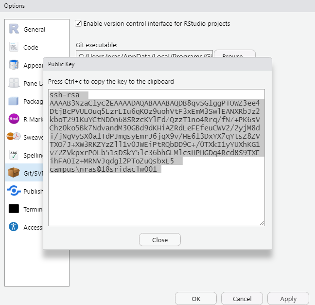
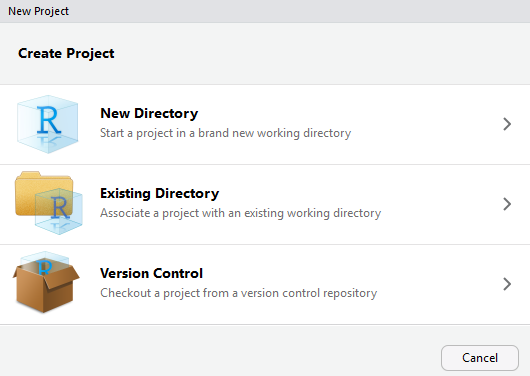

# 1. Introduction
When you are undertaking large complex analyses, it is easy to end up with multiple R scripts, and therefore become confused as to which version is the correct one for your report. Before _version control_ systems were introduced this was a common problem, and I will admit to having some (published) research where relevant scripts include `main_analysis.R`, `main_analysis_final.R`, `main_analysis_final_v2.R` etc. You may have encountered similar problems using Microsoft Word for reports. Another challenge is that of word-processing the Microsoft Word document, then copying and pasting the relevant graphs or tables from RStudio into Word. If your data changes even slightly, all the numbers, tables and graphs will need to be re-copied, and it is easy to make an error.  The aim of this practical is to:

* introduce you to version control using git
* show you how to use remote repositories on GitHub
* explain how to write documents in RStudio RMarkdown that automatically generate Word reports, with R graphs and tables already embedded in them.

# 2. Version control with git
The most popular version control system is git, which is installed on the Campus machines. It is freely-available, and there is excellent tutorial information at <https://git-scm.com/> . Even better, Jenny Bryan has written an excellent online book **Happy Git with R** aimed at RStudio users with no prior knowledge of git, which can be found at <https://happygitwithr.com/index.html>. Git was originally a Linux-based (Mac and Unix) system for version control, but has been ported to Windows; it can be run through a command prompt (either from Windows, or within RStudio) but this can be tricky to get used to if you are unfamiliar with Linux. However, only a small number of commands are needed to get started, and we will focus on using git through the GUI.  Remember that your common working pattern is to create files/scripts, save them, edit them, save them *again*. Git allows you to keep track of this process. Specifically, that last step:

* When you saved it again
* Why you saved it again
* What the contents of the change were

This allows you to track the history of changes you've made to a file:


Most importantly, if you need to, you can easily go back to an earlier version of your file. It is too easy in my experience to have some ecological analysis working perfectly in R, go back to it a few days later, a couple of minor edits, and suddenly it doesn't work but you don't know why. With and without version control:

```{r echo=FALSE, warning=FALSE, out.width="250px"}

```


If you are working in a team with other scientists this becomes particularly powerful, as you can 'merge' changes made by different staff:


## 2.1 Checking if git is already installed
Git is a separate program to RStudio and so needs to be setup independently. First of all you have to check whether git has already been installed onto your machine; it varies and it may have already installed it indirectly from another programme. To check, the easiest method is to use the command 'shell'. This is a window into which you can type commands that the computer's underlying operating system understand. The easiest way of doing this is from inside RStudio. Simply click on the menu `Tools -> Terminal -> New Terminal` and you should notice that instead of the RStudio Console window, you now have an RStudio Terminal window. The only obvious difference is that the Console window begins:

`>`

as it expects you to enter R commands, whereas the Terminal window begins:

`$`

as it expects you to enter Windows, Mac or Linux commands. To check whether git is already installed, at the `$` prompt type:

`which git`

to simply ask the computer to tell you which (if any) version of git it is using. On a Windows machine it will probably return something like:

`/mingw64/bin/git`

whilst on a Mac you may see

`/usr/local/bin/git`

If you get either of the above, then you can also check which version of git you are using:

`git --version`

and this is returning `git version 2.20.1.windows.1` for me. However, if you receive:

`which: no git in (/ming64/bin:/usr/bin:/c/Users/nras/bin:/c/R-4.0.2/bin/x64:/c/Program Files (x86)/Common Files/Oracle/Java/javapath:/c/WINDOWS/system32:/c/WINDOWS)`

or

`which: git not found`

then you need to install it. Fortunately, it is free, and easy to install.

## 2.2 Installing git on your PC or Mac
There are several git packages available, but you'll probably find the "official" ones easiest, at <https://git-scm.com/download/> where you should see something similar to:


If during the **Windows** installation note that:

* When asked about “Adjusting your PATH environment”, make sure to select “Git from the command line and also from 3rd-party software”. Otherwise, accept the defaults.
* RStudio for Windows sometimes prefers for Git to be installed below `C:/Program Files` and this appears to be the default. This implies, for example, that the Git executable is found at `C:/Program Files/Git/bin/git.exe`. Unless you have specific reasons to otherwise, follow this convention. However, on my NUIT-managed PC, a slightly different installation has been used and git is in the `C:/Users` roaming profile area, as multiple users have accounts. Nevertheless, RStudio still locates it successfully.

For **Mac OS** machines git installation is usually straightforward, but let me know if you have any problems.

# 3. Git configuration
Before you can use git it is best to configure it properly. At a minimum, it is useful to tell it your name and email address. At the `$` prompt, i.e. in the **Terminal** window in RStudio, **not** the R Console windows, type, using your email and username, the following. I recommend using `@newcastle.ac.uk` rather than `@ncl.ac.uk` in your email:

`git config --global user.name 'John Smith'`

`git config --global user.email 'j.smith123@newcastle.ac.uk'`

`git config --global --list`

The last command simply checks that git has stored the configuration correctly, and should return the information you have just entered. Having your email and username configured is particularly useful should you do any collaborative work so that it is easy to track who has made which changes.

# 4. What is a "Repository"?
As soon as you start reading about git, you will come across the word _repository_, often shortened to "repo". A repository is simply a folder that is under git version control. It contains some special files and folders to track all the different edits and changes you are making to your R scripts. Importantly, a **local repository** stored on your own PC can also be "pushed" or "pulled" to and from an internet server, where it is called a **remote repository**. This allows easy collaboration. Even if doing a project on your own, it is sometimes easier if you also use a remote repository as it saves having to remember to copy files from e.g a PC at work, to a laptop at home etc.


We'll begin by simply creating a git "repository" locally on your PC and saving some R scripts. Start up RStudio, and begin a new project. When you get to the following screen:

 

Ensure that you tick the box labelled git version control. When your project starts up it will look no different from any other project, except a file labelled `.gitignore` will have appeared. In this files you can list the names of other files and folders that you do *not* want to be monitored by your version control system. This might be e.g. a `data` folder containing a large amount of raw data that rarely changes. The other difference from a standard R Project is that there is now a `git` tab in the top-right panel:


At the moment you git tab just contains the names of two files, the .gitignore file, and the file for the R Project itself (.Rpoj). You'll notice that in the "Status" column next to their filenames is a yellow question mark, indicating that the files are "untracked" by git. Before going any further, it would be useful to configure git so that it knows your email address and name (particularly useful for collaborative projects). This needs to be done from a git command line; click on the Cogwheel symbol labelled `More` in the RStudio Git tab, and click on `Command Shell`. A blank window will appear, in which you should enter the following (changed for your name and email):

Type `exit` to close the git command window. You are now ready to make an initial commit. First tick on the 'Staged' boxes next to the two filenames (the yellow '?' will change to a green A for 'added' symbol), click on the Commit button, write a short piece of text to describe what you've done, and submit your commit:


You may be wondering what the "Staged" process did, and how this relates to Commit. The basic structure is shown below:


In practice I use git in a fairly simple way, in that as soon as I have staged my files, I do a commit. This is the easiest thing to do if (like me!) you still haven't learnt the full power of git. However, it is important that your messages with your commits are clear and informative:

**Good commit messages**

* added a function to display land cover map
* corrected bug in second ggplot call for scatter plot of farms
* linear model results displayed in formatted table
* interactive slider for year added

**Weak or ambiguous commit message**

* fixed some bugs
* edited the display_sheep function
* corrected faulty code in graph

Your comments have to be useful and meaningful. So don't make a commit after a few minor edits; you may want to check details from previous commits, so think of them as providing a table of contents of your edits. A common question is **

# 3. Add some files and start editing
Copy your data folder and R script from the `oystercatchers` example into your `git_example` folder. Git will immediately recognise that you have added the new folder (with its file), as well as the R script, so stage them, run a new commit, with a suitable message.

Now start to edit your `oystercatcher.R` file (or whatever you called it). In my version, there are very few comments, and I have also not set up easy navigation of the file by creating a table of contents (ToC). You can do the latter by adding `####` or `----` at the end of any comment line. The text in the comment will be added to the ToC, which can be easily accessed from the click box at the bottom of the editor window, or pressing the button on the top right. This is very useful for long R scripts to help you navigate. Tidy up your R code, save your file.

After saving your file git should automatically spot that it has been modified, and the R script will be displayed in the git window, with a blue 'M' for modified symbol next to it. Should it not display, click on the clockwise 'refresh' arrow at the top right. Stage the file (click the checkbox) and make another commit again with a suitable message.  You will notice that additions are highlighted in green, deletions in red, for example:


You will recall that the three-way interaction term in the oystercatcher data was meaningless, so edit your R script again to include the the analysis omitting the 3-way term, and summarise the results. Rather than re-specify the whole model, the update function is useful:

```{r 3-way update, eval=FALSE}
# model without 3-way
M2 <- update(M1, . ~ . -Month:FeedingPlot:FeedingType)
summary(M2)
```

Save the script and make another commit, with suitable message. Finally, perhaps it would be useful to plot some diagnostic plots for your new model, to check that it is OK. Make some more edits, save the file again, and undertake another commit with suitable message. *Note*: in reality, these commits are on far too minor changes for them to be worthwhile, and typically you would be making much more substantial changes before committing them in git.

Now, if in the git tab you click on the "History" button you will see a list of your commits, with comments:


(*Note*: on some University Cluster Windows 10 PCs the author emails are not always configured correctly, as you can see here).

# 4. Github
Github provides "remote" repositories, which allow you to push or pull or your git files, plus their entire history, to the online site. It has a user-friendly interface, and free to register. On Github anyone can view your repositories unless you pay a monthly subscription, or based in higher education, when you can have private or public repositories at now charge. Alternative systems such as GitLab exist which are very similar, however, nearly all the documentation online you will encounter will relate to Github, so we will use that for this module.

Begin by going to <https://github.com> and registering for a free account. You will have to enter a username and email. Use you University email address, but I do not recommend you use your University username. This is partly on security grounds (your username is a fairly long alphanumeric code), but more importantly after you have graduated you may want to continue using GitHub in your professional career. Good usernames are something meaningful, based on your real forename, surname or initials. A few suggestions:

* use entirely lower case letters for your username
* do not have any spaces in your username
* if you want to separate parts of your name, use underscores `_` rather than dashes `-`

My username on GitHub is `rasanderson`. If you have a social media account such as Twitter, you may wish to user the same username for consistency.

After you have entered all your details, confirm your email and username. You may need to check your University email account to acknowledge receipt of email to confirm registration.

# 5. Github security
Until July 2020 GitHub offer two methods of accessing 'pushing' your files to their systems, including plain passwords via HTTPS, secure shell protocols SSH. It has now started to offer multi-factor authentication (MFA or 2FA) whereby an additional code is sent to your smartphone. From July 2021 password authentication via HTTPS is going to be withdrawn due to concerns about security breaches. This means that you have to use either SSH or MFA to push files to a repository, even a 'public' one. Whilst this is more secure, it is a little bit more difficult to setup. I have had problems with MFA, so recommend that you try setting this up. SSH security consists of two "keys", one of which is 'private' and you keep on your PC, the other is 'public' which you give to GitHub. The keys use some clever encryption, known as "RSA", so that they know how to talk to each other, like some sort of lock-and-key mechanism, where you cannot actually understand what is going on. Thankfully, RStudio and Github make this easy to setup. There are three steps:

1. Generate (if needed) the linked private and public "keys" used by SSH and store in two files
2. Add the private key to a background program that runs on your computer
3. Give the public key to GitHub

## 5.1 Check if you already have keys, and if needed, create them
It is possible that you already have keys setup. The easiest way of doing this is inside RStudio click on the "Tools -> Global options -> Git/SVN" menus, and you might see a screen like this:


You can see that I have something already listed in ths SSH RSH key box, because I have already setup the relevant keys. It might be blank for you if this is the first time that you have used it. Assuming you do not have keys setup, click on the button **Create RSA key**. RStudio will prompt you for a passphrase, but this is optional and for simplicity I don't bother setting one up. Click **Create** and RStudio will create two files:

* a "private" key, probably stored in `~/.ssh/id_rsa`
* a "public" key, probably stored in `~/.ssh/id_rsa.pub`

Make a note of where the `id_rsa` key has been stored; re-open the RStudio Tools -> Global Options -> Git/SVN window if needed, as you will need the information shortly.

## 5.2 Tell your local machine about these keys
Your local machine needs to know that these keys exist, and it has a little program called an "ssh-agent" running which we need to start running quietly in the background to check on them. The instructions differ slightly for Windows vs Macs.

### 5.2.1 Add keys to ssh-agent on Windows 10 PCs
In the RStudio **Terminal** window (i.e. not the usual Console window), at the `$` prompt type:

`eval $(ssh-agent -s)`

and hopefully it will display something like

`Agent pid 6508`

(The exact number you get will be different). This is the process identification number of the little ssh-agent program that is now running in the background. You then need to add your private key, held in the `id_rsa` file, to this agent. You made a note of where this file is stored earlier. To add this key to the ssh-agent, at the `$` prompt type:

`ssh-add ~/.ssh/id_rsa`

**Note** Depending on your PC, the exact path to the `id_rsa` may be different.

### 5.2.2 Add keys to ssh-agent on Mac OS
It is probably better to open a MacOS Terminal window, rather than use the RStudio Terminal for these commands. At the `$` prompt type:

`eval "$(ssh-agent -s)"`

and hopefully it will return:

`Agent pid 6508`

However, MacOS has tighter security than Windows, and you may receive an error about `mkdtemp: private socket dir: No such file or directory` or an error `Permission denied`. In this case, you need to elevate your security permissions using the `sudo` command. At the `$` prompt type:

`sudo su`

which will ask you for your administrator password. Enter this (it will not be displayed on screen), and the prompt will change from `$` to `#` to indicate you have administrator rights. Now, at the `#` prompt try:

`eval "$(ssh-agent -s)"`

and you should get a process id number displayed. Now that the ssh-agent program is running, you should type `exit` to leave administrator mode, and return to normal user, and the `$` prompt. Finally, you can add your private key to this, using the path to the `id_rsa` file you noted down earlier. At the `$` prompt enter:

`ssh-add ~/.ssh/id_rsa`

and hopefully this will successfully add your private key.

## 5.3 Give GitHub the public SSH key
The clever thing about SSH keys is that the public key is useless without the secret private key on your own PC. This makes it a very secure system, but also saves you having to type in usernames and passwords all the time. So the final step is to inform GitHub of the public key. First, copy it into your clipboard. To do this, in RStudio, go to the "Tools -> Global options -> Git/SVN" menu and click on the blue text "View public key". You should see something similar to:



Copy the public key onto your clipboard as suggested. Now go back to the GitHub website and login if you have not already done so. At the upper top-right of the main screen is a small down-arrow. Click on this and go to the Settings menu:


On the screen that is displayed, on the left-hand side pick the menu tab called **SSH and GPG keys**. Click the green button to add a **New SSH key** and you should see the following screen:


Into the *Title* box enter something informative such as "My laptop" or "University account" etc. Then in the box below, simply paste the mysterious cryptic text of the public key that you copied from RStudio. Finally click the green button "Add SSH key".

You'll be relieved to know that these steps only have to be done once on your computer. However, if you have multiple computers, you will have to create additional private-public SSH keys. So I have a key-pair for the computer in my office at work, and a separate one for my laptop, both registered with Github.


Click the large *+* sign to add a new repository, giving it the same name as your example RStudio project. Here is a screenshot of the appearance for me:


Set the repository as public (default) and don't add a ReadMe file. The following screen (or similar) will be displayed:


You already have an existing (local) repository on your machine, so it is the second option you want. However, before we go futher, we need to set up some security Conveniently, the Github screen has a little copy button next to the key commands, which for me are:

```{r github setup commands, eval=FALSE}
git remote add origin https://github.com/rasanderson/git_example.git
git push -u origin master
```

In RStudio, from the Git tab open the Command window, and enter the above lines. You will probably receive an error as it will need to know your Github username and password. Once these are entered, your files will be uploaded onto Github. If you go back to Github, you will see your R script, R project files, and the data folder all listed, plus all the commits:


This is very useful. For example, I find that I can commit and push work from inside RStudio, you can use the Pull and Push buttons, which becom active in RStudio once Github is connected. Then if I am working at home I can 'Pull' the latest version of the code, edit it, 'Push' it back to the repository. On return to the office the following day, I then 'Pull' the changes back from Github. No more need to carry USB sticks around or forget what changes you made!

Git and Github are both extremely powerful tools, and there are large amounts of online tutorials and videos available. Useful tricks include creating 'branches' to test out new ideas, or moving the 'head' back to an earlier position if you want to work on and older version of your research. The easiest way to learn is to play around with a dummy R script, pushing and pulling changes from different commits. If you make a mistake it doesn't matter.

# 5. Using Github Classroom
## 5.1 Setup
I have created a 'classroom' account on Github, with versions of the oystercatcher exercise you did with me last week. You can use this to create a new R Project that will be automatically linked to Github. You can then create a 'branch' to work on, edit it, and ask me to comment on your changes before merging back into your existing workflow.  Go onto Blackboard, and under the Learning Materials navigate to the Oystercatchers Example and click on <https://classroom.github.com/a/Gy98rpXP>. Follow the instructions, and it should copy all the material from my Github Classroom onto your own Github account. Your Oystercatcher repository will probably have your Github username appended to it. You should also receive a confirmatory email. One your Oystercatcher repository that you have just created on Github, click on the "Clone or Download" button, and copy the https address (there is a small button to copy it). Here is an example for a student called "bio8068person":


Close any R Projects you have open, and click on File -> New Project. If git is configured properly, you should be able to check out a project from version control:



On the next screen select the Git option, and paste into the URL the web address that you have just created. Store your R project in a suitable folder. All the data files and R scripts will now be available on your local machine. After you have made commits, you can push them back to Github.

## 5.2 Allowing others to comment on your code
If you want me to comment on your code, the simplest thing is to create a branch, either in RStudio or preferably in Github (pull the changes back). Make a few edits, commits, and push to Github. Then issue a "pull request". You can enter some comments, e.g. "Does this look OK?". I should then receive and email with a link to your code, which I can comment on. Once we agree that the code looks OK, we can merge your branch back into the main code, and you can continue working. We can explore this interactively during the practicals so that we are all confident with this method of collaboration.

# 6. Reproducible research
Ideally you want to be able to create reproducible your research, so that it can be undertaken by someone else, following your instructions, in the same way as you would a laboratory report. If you are writing your own documents, you want to ensure that the text in it accords exactly with the data. This is why it is best to clean up the raw data in R, rather than editing it in Excel. RStudio projects greatly facilitate good practice, for example in an RStudio project folder I often have separate sub-folders for

* data (raw data)
* figs (usually ggplot figs or maps generated by R)
* R ( if it is a very complex set of analyses, I might put R functions into their own sub-folder, and use the `source` function at the start of a `main.R` script in the project folder itself)

Depending on the complexity of the project, you might want output folders for Word documents or processed data.

At this point you might be wondering how to create Word documents. The `Rmarkdown` and `knitr` packages provide a powerful method of writing text in R, and creating high-quality documents.  Begin by installing the rmarkdown package:

```{r install rmarkdown, eval=FALSE}
# Install rmarkdown from CRAN
install.packages("rmarkdown")
```

Now, instead of a standard R script, you are going to create an RMarkdown script. Click on `File -> New File` and select the `R Markdown` option. A setup screen will appear for you to enter details about your document:


A new `Untitled1` file will be created, that is already pre-populated with some text. Save the file in your project, giving it a name ending in `.Rmd` to indicate that it is markdown format.  Click on the `knit` button at the top of the RMarkdown file and it will be instantly converted into HTML format for viewing. If you want a Word document, that is also available via the down-arrow next to the Knit button. You may have to open Word first, but usually it should display automatically. When preparing documents I tend to work mainly in HTML for previewing the output, as it is slightly quicker to Knit together.

The example script already shows you a lot of features of RMarkdown. You can embed R code, decide whether or not to display the R code, or just the output, decide whether to execute the code, etc. You also have control on text size, can create equations, and so on.  For example `_italics if prefix or suffix with an underscore or one asterisk_` will display _italics if prefix or suffix with an underscore or one asterisk_ whilst `**bold if prefix or suffix with two asterisks**` will give **bold if prefix or suffix with asterisks**. Lines that begin with a `#` symbol control the headings, sub-headings etc., with the more `#` symbols the lower the subheading.  Therefore

`## This is a level 2 heading`
gives

## This is a level 2 heading

whilst
`### This is a level 3 heading`
gives

### This is a level 3 heading

Look at the code "chunks" in the example markdown document. Notice how sets of R commands begin and end with three backslash symbols. The buttons on the right allow you to execute the code in all preceding chunks, or just the one you are working on.

*Exercise* : Copy and paste R code from your oystercatcher analysis script into your new RMarkdown document. Try and write a simple narrative about what you are doing. You will then have a complete document that is reproducible, and shows the results of your analyses.

There is a lot of useful online information on RMarkdown, including a 'cheat sheet' (available from RStudio Help menu), the main website <https://rmarkdown.rstudio.com> and an online book <https://bookdown.org/yihui/rmarkdown/>. The latter was only published in 2019, so this is a fast-moving field. You can even include references and bibliographies in the system (I will admit that I haven't progressed that far yet.)

Finally, this practical schedule was not written in Microsoft Word, it was written in RMarkdown!  As it is hosted on Github, you can download this document and edit and play with it yourself. This will also improve your skills. If you want to clone the RMarkdown file, and all the associated documents, open up a Git command window from the Command Line and type

`git clone https://github.com/rasanderson/BIO8068_reproducible.git`

As this is a public repository, and you are pulling rather than pushing changes, it should not prompt you for a username or password.