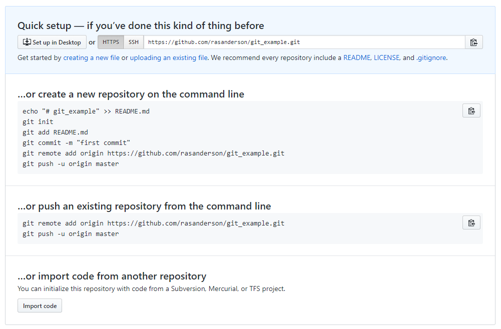

## 1. Introduction
When you are undertaking large complex analyses, it is easy to end up with multiple R scripts, and therefore become confused as to which version is the correct one for your report. Before _version control_ systems were introduced this was a common problem, and I will admit to having some (published) research where relevant scripts include `main_analysis.R`, `main_analysis_final.R`, `main_analysis_final_v2.R` etc. You may have encountered similar problems using Microsoft Word for reports. Another challenge is that of word-processing the Microsoft Word document, then copying and pasting the relevant graphs or tables from RStudio into Word. If your data changes even slightly, all the numbers, tables and graphs will need to be re-copied, and it is easy to make an error.  The aim of this practical is to:

* introduce you to version control using git
* show you how to use remote repositories on gitlab or github
* explain how to write documents in RStudio RMarkdown that automatically generate Word reports, with R graphs and tables already embedded in them.

## 2. git version control
The most popular version control system is git, which is installed on the Campus machines. It is freely-available, and there is excellent tutorial information at <https://git-scm.com/> . It was originally a Linux-based (Unix) system for version control, but has been ported to Windows; it can be run through a command prompt (either from Windows, or within RStudio) but this can be tricky to get used to if you are unfamiliar with Linux. However, only a small number of commands are needed to get started, and we will focus on using git through the GUI.  Remember that your common working pattern is to create files/scripts, save them, edit them, save them *again*. Git allows you to keep track of this process. Specifically, that last step:

* When you saved it again
* Why you saved it again
* What the contents of the change were

This allows you to track the history of changes you've made to a file:


If you are working in a team with other scientists this becomes particularly powerful, as you can 'merge' changes made by different staff:


We'll begin by simply creating a git "repository" locally on your PC and saving some R scripts. Start up RStudio, and begin a new project. When you get to the following screen:

 

Ensure that you tick the box labelled git version control. When your project starts up it will look no different from any other project, except a file labelled `.gitignore` will have appeared. In this files you can list the names of other files and folders that you do *not* want to be monitored by your version control system. This might be e.g. a `data` folder containing a large amount of raw data that rarely changes. The other difference from a standard R Project is that there is now a `git` tab in the top-right panel:


At the moment you git tab just contains the names of two files, the .gitignore file, and the file for the R Project itself (.Rpoj). You'll notice that in the "Status" column next to their filenames is a yellow question mark, indicating that the files are "untracked" by git. Before going any further, it would be useful to configure git so that it knows your email address and name (particularly useful for collaborative projects). This needs to be done from a git command line; click on the Cogwheel symbol labelled `More` in the RStudio Git tab, and click on `Command Shell`. A blank window will appear, in which you should enter the following (changed for your name and email):

```{r git setup, eval=FALSE}
git config --global user.name 'Your Name'
git config --global user.email 'your.email@newcastle.ac.uk'
```

Type `exit` to close the git command window. You are now ready to make an initial commit. First tick on the 'Staged' boxes next to the two filenames (the yellow '?' will change to a green A for 'added' symbol), click on the Commit button, write a short piece of text to describe what you've done, and submit your commit:


It is possible you may get a warning message about the author name and email (sometimes the configuration does not store correctly on Windows), in which case simple follow the instructions (check with me):

```{r git warning messages, eval=FALSE}
git config --global --edit
git commit --amend --reset-author
```

You may be wondering what the "Staged" process did, and how this relates to Commit. The basic structure is shown below:


In practice I use git in a fairly simple way, in that as soon as I have staged my files, I do a commit. However, it is important that your messages with your commits are clear and informative:

* added function to display land cover map (good)
* corrected bug in second ggplot call for scatter plot of farms (good)
* fixed some bugs (bad)
* edited the display_sheep function (bad)

Your comments have to be useful and meaningful. So don't make a commit after a few minor edits; you may want to check details from previous commits, so think of them as providing a table of contents of your edits.

## 3. Add some files and start editing
Copy your data folder and R script from the oystercatchers example into your git_example folder. Git will immediately recognise that you have added the new folder (with its file), as well as the R script, so stage them, run a new commit, with a suitable message.

Now start to edit your oystercatcher.R file (or whatever you called it). In my version, there are very few comments, and I have also not set up easy navigation of the file by creating a table of contents (ToC). You can do the latter by adding `####` or `----` at the end of any comment line. The text in the comment will be added to the ToC, which can be easily accessed from the click box at the bottom of the editor window, or pressing the button on the top right. This is very useful for long R scripts to help you navigate. Tidy up your R code, save your file.

After saving your file git should automatically spot that it has been modified, and the R script will be displayed in the git window, with a blue 'M' for modified symbol next to it. Should it not display, click on the clockwise 'refresh' arrow at the top right. Stage the file (click the checkbox) and make another commit again with a suitable message.  You will notice that additions are highlighted in green, deletions in red, for example:


You will recall that the three-way interaction term in the oystercatcher data was meaningless, so edit your R script again to include the the analysis omitting the 3-way term, and summarise the results. Rather than re-specify the whole model, the update function is useful:

```{r 3-way update, eval=FALSE}
# model without 3-way
M2 <- update(M1, . ~ . -Month:FeedingPlot:FeedingType)
summary(M2)
```

Save the script and make another commit, with suitable message. Finally, perhaps it would be useful to plot some diagnostic plots for your new model, to check that it is OK. Make some more edits, save the file again, and undertake another commit with suitable message. *Note*: in reality, these commits are on far too minor changes for them to be worthwhile, and typically you would be making much more substantial changes before committing them in git.

Now, if in the git tab you click on the "History" button you will see a list of your commits, with comments:


(*Note*: on some Windows 10 PCs the author emails are not always configured correctly, as you can see here).

## 4. Github and Gitlab
Github and Gitlab provide "remote" repositories, which allow you to push or pull or your git files, plus their entire history, to the online site. They both have user-friendly interfaces, and are similar to use, and free to register. Github is much more popular (it is the older system) and is a commercial, close-source product. Gitlab is newer, open-source (you can host it on your own server). From the user's perspective, on Github anyone can view your repositories unless you pay a monthly subscription, whereas on Gitlab you can have private or public repositories at now charge. However, nearly all the documentation online you will encounter will relate to Github, so we will use that for this module.

Begin by going to <https://github.com> and registering for a free account. After you have entered all your details, and confirmed your email and username. Click the large *+* sign to add a new repository, giving it the same name as your example RStudio project. Here is a screenshot of the appearance for me:


Set the repository as public (default) and don't add a ReadMe file. The following screen (or similar) will be displayed:



You already have an existing (local) repository on your machine, so it is the second option you want. Conveniently, the Github screen has a little copy button next to the key commands, which for me are:

```{r github setup commands, eval=FALSE}
git remote add origin https://github.com/rasanderson/git_example.git
git push -u origin master
```

In RStudio, from the Git tab open the Command window, and enter the above lines. You will probably receive an error as it will need to know your Github username and password. Once these are entered, your files will be uploaded onto Github. If you go back to Github, you will see your R script, R project files, and the data folder all listed, plus all the commits:


This is very useful. For example, I find that I can commit and push work from inside RStudio, you can use the Pull and Push buttons, which becom active in RStudio once Github is connected. Then if I am working at home I can 'Pull' the latest version of the code, edit it, 'Push' it back to the repository. On return to the office the following day, I then 'Pull' the changes back from Github. No more need to carry USB sticks around or forget what changes you made!

Git and Github are both extremely powerful tools, and there are large amounts of online tutorials and videos available. Useful tricks include creating 'branches' to test out new ideas, or moving the 'head' back to an earlier position if you want to work on and older version of your research. The easiest way to learn is to play around with a dummy R script, pushing and pulling changes from different commits. If you make a mistake it doesn't matter.

## 5. Reproducible research
Ideally you want to be able to create reproducible your research, so that it can be undertaken by someone else, following your instructions, in the same way as you would a laboratory report. If you are writing your own documents, you want to ensure that the text in it accords exactly with the data. This is why it is best to clean up the raw data in R, rather than editing it in Excel. RStudio projects greatly facilitate good practice, for example in an RStudio project folder I often have separate sub-folders for

* data (raw data)
* figs (usually ggplot figs or maps generated by R)
* R ( if it is a very complex set of analyses, I might put R functions into their own sub-folder, and use the `source` function at the start of a `main.R` script in the project folder itself)

Depending on the complexity of the project, you might want output folders for Word documents or processed data.

At this point you might be wondering how to create Word documents. The `Rmarkdown` and `knitr` packages provide a powerful method of writing text in R, and creating high-quality documents.  Begin by installing the rmarkdown package:

```{r install rmarkdown, eval=FALSE}
# Install rmarkdown from CRAN
install.packages("rmarkdown")
```

Now, instead of a standard R script, you are going to create an RMarkdown script. Click on `File -> New File` and select the `R Markdown` option. A setup screen will appear for you to enter details about your document:


A new `Untitled1` file will be created, that is already pre-populated with some text. Save the file in your project, giving it a name ending in `.Rmd` to indicate that it is markdown format.  Click on the `knit` button at the top of the RMarkdown file and it will be instantly converted into HTML format for viewing. If you want a Word document, that is also available via the down-arrow next to the Knit button. You may have to open Word first, but usually it should display automatically. When preparing documents I tend to work mainly in HTML for previewing the output, as it is slightly quicker to Knit together.

The example script already shows you a lot of features of RMarkdown. You can embed R code, decide whether or not to display the R code, or just the output, decide whether to execute the code, etc. You also have control on text size, can create equations, and so on.  For example `_italics if prefix or suffix with an underscore or one asterisk_` will display _italics if prefix or suffix with an underscore or one asterisk_ whilst `**bold if prefix or suffix with two asterisks**` will give **bold if prefix or suffix with asterisks**. Lines that begin with a `#` symbol control the headings, sub-headings etc., with the more `#` symbols the lower the subheading.  Therefore

`## This is a level 2 heading`
gives

## This is a level 2 heading

whilst
`### This is a level 3 heading`
gives

### This is a level 3 heading

Look at the code "chunks" in the example markdown document. Notice how sets of R commands begin and end with three backslash symbols. The buttons on the right allow you to execute the code in all preceding chunks, or just the one you are working on.

*Exercise* : Copy and paste R code from your oystercatcher analysis script into your new RMarkdown document. Try and write a simple narrative about what you are doing. You will then have a complete document that is reproducible, and shows the results of your analyses.

There is a lot of useful online information on RMarkdown, including a 'cheat sheet' (available from RStudio Help menu), the main website <https://rmarkdown.rstudio.com> and an online book <https://bookdown.org/yihui/rmarkdown/>. The latter was only published in 2019, so this is a fast-moving field. You can even include references and bibliographies in the system (I will admit that I haven't progressed that far yet.)

Finally, this practical schedule was not written in Microsoft Word, it was written in RMarkdown!  As it is hosted on Github, you can download this document and edit and play with it yourself. This will also improve your skills. If you want to clone the RMarkdown file, and all the associated documents, open up a Git command window from the Command Line and type

`git clone https://github.com/rasanderson/BIO8068_reproducible.git`

As this is a public repository, and you are pulling rather than pushing changes, it should not prompt you for a username or password.